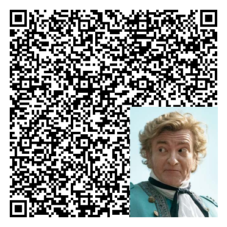
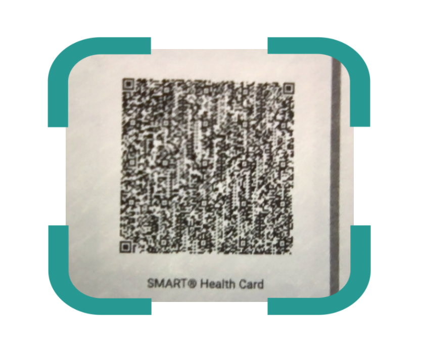
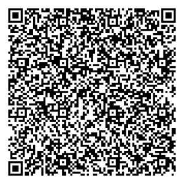
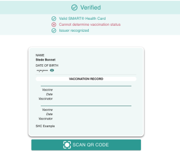

# Immunization QR Codes for Testing the Web Verifier
### Digital Vaccine Credential Initiative

 
<!-- Table of Contents

1	Background information on how the QR codes were generated	3
1.1	Modifications to the SHC Web Verifier App	3
2	QR Codes	4 -->

 
## Background information on how the QR codes were generated  
Test patient details used throughout the QR codes:
- Name: Stede Bonnet
- Birth Date: 06/24/1984
- Immunizations:
    - Pfizer COVID-19 Vaccine on 08/01/2021
    - Pfizer COVID-19 Vaccine on 08/22/2021

## Modifications to the SHC Web Verifier App
To generate a QR code that is recognized by the verifier, the [shc-web-verifier app](https://github.com/dvci/shc-web-verifier) was edited and run locally. The `defaultIssuerDirectories` in the [src/utils/IssuerDirectories.js](https://github.com/dvci/shc-web-verifier/blob/main/src/utils/IssuerDirectories.js) file was redirected from the main vci-issuers directory to a new repository with a vci-issuers directory that includes the Sample Issuer as a verified issuer:
```
const defaultIssuerDirectories = [
    {
        name: 'SMART Spec issuer',
        URL: 'https://raw.githubusercontent.com/karbates/shc-issuers/main/vci-issuers.json',
    },
];
```

## QR Codes

#### Working QR Code

- 
- <details><summary>Numeric SHC</summary> shc:/5676290952432060346029243740446031222959532654603460292540772804336028702864716745222809286437255265200745635807533945525326373052254142563945774003597340427526404212623141410341392964530503753965557741232060573601044529355311287423324250600657715706427012325905054203385329562936035833774536644145294232333973356854745842217008504364127257651200777236415831295539347153523244127060610577236130723738415527652965307569596339387337756237065222202071416723644010726203635608246237363200590628355371366163000365734072697240283800282965532733561268333167690775666462092939005224416920325821727040236521083175535738210606713009257244336157413222436440372264290069567739634038391052215276646776083221622923454037453809303711334528205804450659643445243521555620272526617674692126380564226463402927052453036835753408661054744328586676712138450944110335395245262776383932116135337554273622034061277720327444110503587053046127430539262973755433293021656520722561106652265207696639526142537277236773610042652371437628713365245761647525414332007603291131243970683820443962240321085562456121333767405773690854586138652755645034377731623777623261383222652229310634006575007725722170061152343273002331761120661050080323352574013262122705072130122061626660560440344343356959533012626671705864277459384342586955304034084361335662572422456436277043626575730539667705201233406436632731573433633452751120
</details>

#### Unreadable QR code
- Cause of error: The QR code cannot be read by the scanner because of issues such as low contrast, damage, distortion, etc.
- Change made to working QR code: pasted an image onto the QR code
- 
- Another option for testing an unreadable QR code, from a blurred version of a health card generated by the [dvci/health_cards](https://github.com/dvci/health_cards) Ruby Issuer reference implementation: 
<!--  -->
- <a href="Undreadable QR B">
  
  </a>

#### Non-SMART Health Card compliant QR code
- Cause of error: the QR code is readable, but the QR code does not contain a SMART Health Card.
- 

#### Unable to fetch Issuer keys
- Cause of error: either key URL is not available (status > 200) or no internet access (offline), so the JWS could not be validated. 
- 

#### Invalid signature
- Cause of error: the SMART Health Card signature is invalid, meaning the JWS could not be validated. 
- Change made to working QR code: altered the signature in the signed payload
- 
- <details><summary>Numeric SHC</summary> shc:/567629095243206034602924374044603122295953265460346029254077280433602870286471674522280928613331456437653141590640220306450459085643550341424541364037063665417137241236380304375622046737407532323925433443326057360104452850391132742432425076102764650934056328762559360567593641045429046944003944625604243138615765433338373341386432630511537357734357052103616566282330001144415256665225286469725740415472426937272153725939067326074072673940314168283626000540312345632642770945373362617565244336226058507459745259563504646572337275602834215226720905375571046800547600335063406639225531555857692228392524694243432206537737703027767571300563570331692030422238452062614373601052274267113370052230324055440339224236356328402869413135416727206661347125415962293558682062237726625471690942603363584469552639532254100426246538035072443305390344056224205054590927705361092970046454390309446812273624114065271223060344110505296233081063730645206206216233292427275945205210030308522836676755073345710621565276353907224242096553753359552667523934636464667170393620765562265577093355122132063725542470537126602371333563033260280337695909343654764369244526773429732726537332006559090755542208501103542910502643591228396000770809003974012736426039573450676537233710104306613928665550301266306603276010350660236924282063007456615312450658253504742265565241353121525276093376395240385050760653046573744304040404
</details>

#### Valid SHC signature but malformed payload
- Cause of error: the SMART Health Card contains a valid signature, but the payload is malformed due to factors such as a missing credentialSubject, missing fhirBundle, or JSON parsing errors.
- Change made to working QR code: removed the contents of the fhirBundle from the minified payload
- 
- <details><summary>Numeric SHC</summary> shc:/5676290952432060346029243740446031222959532654603460292540772804336028702864716745222809286133314564376531415906402203064504590856435503414245413640370636654171372412363803043756220467374075323239254334433260573601235467372266205823202336720074104324526356457163227432335436722209341004737111235974582438306741206829406162443033400432424534290423452173686540772831507369592121005609361023770422505634615444101153062074016561084434320773693572391033746224402456080638292024755024413457605326740823743541450463746734074065663358522063452855666121682941732275775433727630302772087636610439642674
</details>

#### Missing patient data
- Cause of error: Patient Resource is missing from QR’s FHIR bundle
- Change made to working QR code: removed patient resource from FHIR bundle in credential
- 
- <details><summary>Numeric SHC</summary> shc:/567629095243206034602924374044603122295953265460346029254077280433602870286471674522280928613331456437653141590640220306450459085643550341424541364037063665417137241236380304375622046737407532323925433443326057360104453008407032742428535745426255437575054320283333442626385227286404603231276303562128765765554255676024280423615372043506500910115909247141212107047565687638752757314471707607216763033954764568420522421245052464042271245423245261412668697008616671080341424370452541623936540961050727445536734176552710414340772531213862347000297173413073232465713566410831664355395227453639544428063022384457505666417236723704660374770559701125377425525575376910741271526942722875336520712945055234673128102658423265586765077462743023410665227040582800225928323650366163650626742369647321031059450309232373662656552207450572370753694268613305336172693235055424400357223431422971332470286541713629101054620734332976333238597240363640553166503721456522332163436657596856283205083300346556004574285567296242567771297663671124430306285639605062063223083575030777501154563562333435745020770673013855531204292760315738356862232829457265403238004460584358122132697367583153620066773477292873097566580011232768456165385658392132597734032922126633385767062725544222425058
</details>

#### Contains fhirBundle that is not profile compliant
- Change made to working QR code: removed everything related to vaccination details from the FHIR bundle, including the type and date
- 
- <details><summary>Numeric SHC</summary> shc:/56762909524320603460292437404460312229595326546034602925407728043360287028647167452228092861333145643765314159064022030645045908564355034142454136403706366541713724123638030437562204673740753232392543344332605736016745272139703274232853577541761071676530216163344331585923536058275331406603256742604334752961091061584071266361433261330345573573080312642121203662354021046240664056555904450852632145526530715721033057255571537724403924570362282553530322300553406608503468247364116923314452672110662505352825113477633555044159324070266876087567050061325976313972391221064204333142085963442705423032616600747669711236400768035244755037590038370330416310635843106755372555533532362606416531691152343135281065664033035566655375657426316966335468385845116022457568544237415276745058034365272129616905523131720462384574344158322743377056076208375260677253096729344571326876356507756166585457652723203205521175752464323628676000296662503762063527575627765005626561095750276823356156121123652474017333755735674310713829442808735838387241006607266054047356623728424033684410252521456721326111295752200369613167313123583042326225541164410032432321235763071032523925266174
</details>

- The screenshot below shows the verifier's response to this QR. The team discussed that any further messaging to clarify the error (like indicating that the vaccinations are not recognized or are not present) would require extensive error testing that is out of scope. Screenshot included for reference 
- 	 

#### Missing #health-card type
- Cause of error: The QR code payload's `vc.type` does not contain a `#health-card` type
- Change made to working QR code: Removed the following three URLs from the `vc.type` array: "https://smarthealth.cards#health-card", "https://smarthealth.cards#covid19", "https://smarthealth.cards#immunization"
-  
- <details><summary>Numeric SHC</summary> shc: 567629095243206034602924374044603122295953265460346029254077280433602870286471674522280928613331456437653141590640220306450459085643550341424541364037063665417137241236380304375622046737407532323925433443326057360104453133397032742428395745545008290936637511302526042831637666270412620337660755054008246857317269333260305869603926093445100055265762287463666666434272710540545409034054705554680440035459256770075420043009213260047262107607424238312024443408372754664054667104402006262233765862640411357263366100726464255640256159415203286600383022424250107052412206752274255438036339435962205854762172243644672774056258362669370732757728597456572120753969113037636545200321607257744525703103526277417144340628270440372655113007126624087377381230502874305428707305217239665256642135622009446700332526007005266754072634765767566664036220366107047466733357046934260925646650641040270910201025030012710631596807081234532441555477273374317456373076452063393336433665040337772622232167435757636234603939655808647357320933092409283120053945456062040462577205083607670633125711423435726558533570771123416356231135605709355820016862616227373928535573307225366153670963120454432525007511614320390309552404347068363923291250725366776422725832533031707541691037622134637627573975212844375473292171087136
</details>	 

#### Valid SHC not of vaccine card type #immunization
- Cause of error: The QR code payload’s `vc.type` does not contain an `#immunization` type.
- Change made to working QR code: Removed the following two URLs from the `vc.type` array: "https://smarthealth.cards#immunization", "https://smarthealth.cards#covid19"
-  
- <details><summary>Numeric SHC</summary> shc:/567629095243206034602924374044603122295953265460346029254077280433602870286471674522280928613331456437653141590640220306450459085643550341424541364037063665417137241236380304375622046737407532323925433443326057360104412810391132742435077375086606284442325944403368444025454322555205356205292771372936685008047740682260282652116557355512062834283076252459696534637326325555302843573233416725207556373361702836260505403053254145284363077170245423206639762005065428085735657164054554360376094568283204355360066228503621412033755861546629296357120866422435327205245644296137415262453211386830402935067170635604752211630725673005733128202861281024645626276667270703625824266956113475392061743243582275416854705274416271455809523209587206245832692742236376211241283761562258717475080343396476283562763132115935341242776658396321356420545875127167331270423068057104343871673328585836442634552207520572297477437141221076527755420757711143056607244472502873247367774460616964747670371126623970723652756466326623720928613023427738667335676734363938653555640072377769624010400537676425762738436856125308715676435605253950530726775775660776500732432903216173506538345455013153381220230835331276576574624538393735385733052757625671642020060460062029722456036241776040774309336106572423350962084072322539227630250521600636446762544400620660643458
</details>
 
#### Valid SHC not of vaccine card type #covid19
- Cause of error: Not an error, but the QR code payload’s `vc.type` array does not contain the `#covid19` type. (Note: this type is considered optional according to the [SMART Health Cards: Vaccination & Testing FHIR Implementation Guide](https://build.fhir.org/ig/HL7/fhir-shc-vaccination-ig/index.html)).
- Change made to working QR code: Removed the following  url from the `vc.type` array: "https://smarthealth.cards#covid19"
- 
- <details><summary>Numeric SHC</summary> shc:/567629095243206034602924374044603122295953265460346029254077280433602870286471674522280928613331456437653141590640220306450459085643550341424541364037063665417137241236380304375622046737407532323925433443326057360104452935391132742332425060106505350940533536077206292005723020557071375358123062387130303257421007103623297053246455105435615050657103232226725959336808046745757731413876210477714145377703426277360722402970716326637562003925123876532155217730205058126004220057314153377164432804327261696077253905526067224308233345450466646209295500522441692034582172704023652108313153732130372710567159436326441005645923753066673732505571256776682906036120714539400845402162292745247654085525280026406222580445065964344562342277112052303339596742383262715427221011383753225509412310730359245569205422063659305470005427086956256564442526264265066072296821276062445432207721697561672374753133006170643037672955292024733832540927743963566159727130683303285250574244433211292605076361335072715873291052606065655037584511102836706454347427582966610437624565223121674257576966542464653434773300116163436667627070613732086426386564551234230664675423453574055445431126436711296173506536321127015027546277440775702376405240094252056741366262245910033874295239395724045012445935766041730712745250250730772204587273723973373473433109347511643303096709292350650359036720
</details>

#### Invalid vaccine primary series
- Cause of error: invalid vaccine primary series (missing immunizations, etc.). SMART Health Card is formatted correctly, but contains immunizations that do not count as a valid completed primary series according to the [CDC's Clinical Decision Support for Immunization (CDSi)](https://www.cdc.gov/vaccines/programs/iis/cdsi.html#logic) Supporting Data guidelines. 
- Change made to working QR code: removed the first vaccination from the fhirBundle of the payload in a two-part vaccination series
- 
- <details><summary>Numeric SHC</summary> shc:/56762909524320603460292437404460312229595326546034602925407728043360287028647167452228092861333145643765314159064022030645045908564355034142454136403706366541713724123638030437562204673740753232392543344332605736015745313153663274242443504553696344412256313333727268724071297068221155325860716128127258672127500661266238673600052006543443357323265636776224216357563330123140333858384106356930003930410765587165366727656555302736676841720324282756105227284571343277376361030739331174580920544045503063213033097377277354740461246638234006776745040905426512753166501141227135293263732233582959704039712941576955735621745855310003695233103672542068442922772960215756696367553069775221642640666808752866277060532836664143680438663842273864713628313766317328582003690627401163666852663441033766127636097636750405707353622369441226550429227327245737605231375639643206605727312306287626436058000044220061060904625550455429101004580429747004662820620931663940002661303638333230574159323471347764331200364166724542522911445603692254043262762555053720263166592974716633500524393643417438777224563134627650433609296121227127390925652171456107581160126260777334574245127323120927315503293172576809576222011236007270703754262150506267737136767470503565745241773935706445253360037728430925302268344552577407433805606224073653047700076721445627752940776032384136405250760644271274
</details>

#### Issuer not recognized
- Cause of error: the issuer is missing or cannot be found in the issuer directory
- Change made to working QR code: no change - run the working, verified QR code on the top of this pate outside of the local app, without the change to the `defaultIssuerDirectories`
- 
- <details><summary>Numeric SHC</summary> shc:/5676290952432060346029243740446031222959532654603460292540772804336028702864716745222809286437255265200745635807533945525326373052254142563945774003597340427526404212623141410341392964530503753965557741232060573601044529355311287423324250600657715706427012325905054203385329562936035833774536644145294232333973356854745842217008504364127257651200777236415831295539347153523244127060610577236130723738415527652965307569596339387337756237065222202071416723644010726203635608246237363200590628355371366163000365734072697240283800282965532733561268333167690775666462092939005224416920325821727040236521083175535738210606713009257244336157413222436440372264290069567739634038391052215276646776083221622923454037453809303711334528205804450659643445243521555620272526617674692126380564226463402927052453036835753408661054744328586676712138450944110335395245262776383932116135337554273622034061277720327444110503587053046127430539262973755433293021656520722561106652265207696639526142537277236773610042652371437628713365245761647525414332007603291131243970683820443962240321085562456121333767405773690854586138652755645034377731623777623261383222652229310634006575007725722170061152343273002331761120661050080323352574013262122705072130122061626660560440344343356959533012626671705864277459384342586955304034084361335662572422456436277043626575730539667705201233406436632731573433633452751120
</details>

#### Valid SHC of VC type #immunization that is not a profile compliant vaccine bundle
- Cause of error: The QR code payload’s `vc.type` array contains an immunization type, but the payload does not conform to the [Vaccination Profile](https://build.fhir.org/ig/HL7/fhir-shc-vaccination-ig/StructureDefinition-shc-vaccination-dm.html)
- Change made to working QR code: swapped CVX 208 code to 280 (a non-existent code)
- 
- <details><summary>Numeric SHC</summary> shc:/5676290952432060346029243740446031222959532654603460292540772804336028702864716745222809286133314564376531415906402203064504590856435503414245413640370636654171372412363803043756220467374075323239254334433260573601044531313970327424244350455561640744390363384274444455244444340954290467440039446256042463226950776158715262410869326372076171651059041023122808303027057365416364696642375628525365053343356209245575423170400606693630434069682360042466335453303135672926327741707465384525573712203130355758557604220043296057704155274466072528390942385653677135766543716712301222444367454536714437382070416860120834687542100060113227386767530526520331652130305922404511543157640308432262000536376063683470746240210537046428032265044521402931236939424424632811256524362252330661361162446852663253667741096264046361776970083326393404583345273671305436551205256671675843324573265643272643210732354121111158272324270469285071607406657234775464224355262003653654762662756371396137675930686406660464065475095307753458085545686359601039543376406056694135377321212161290037772170336860302012726030447536045204262709004329284528396610275840546008633276294465704170276935703272731200444350252361506707277750325020687473211143033412270320016075453971502200565465677272294276447304682337725661383525277170426020565700746673706271447359543876262757532859036171630333626523347707702008657069332329235838006729443958
</details>