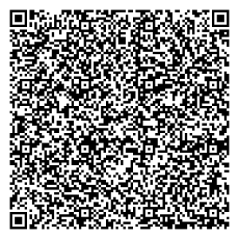
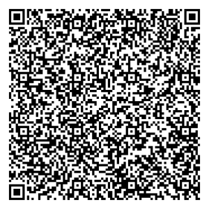
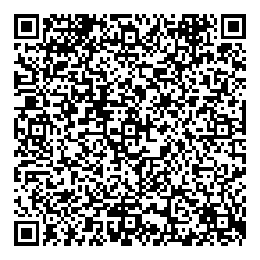
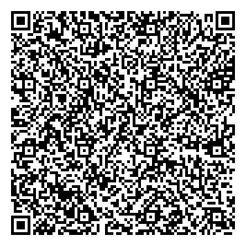
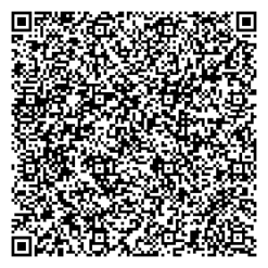
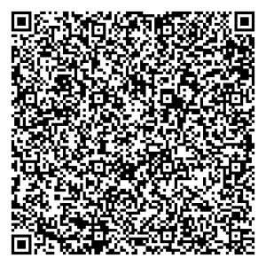

# Lab Result QR Codes for Testing the Web Verifier
### Digital Vaccine Credential Initiative


 
<!-- Table of Contents

1	Background information on how the QR codes were generated	3
1.1	Modifications to the SHC Web Verifier app	3
1.2	Additional esources for testing and QR code generation	3
2	QR Codes	4 -->

 
## Background information on how the QR codes were generated  
Test patient details used throughout the QR codes:
- Name: Max Mayfield
- Birth Date: 06/09/1980
- Lab Result:
    - SARS-CoV-2 (COVID-19) RNA panel - Unspecified specimen by NAA with probe detection
    - Result: Positiive
    - Date: 03/01/2022
    - Status: final

## Modifications to the SHC Web Verifier app
To generate a QR code that is recognized by the verifier, the [shc-web-verifier](https://github.com/dvci/shc-web-verifier) app was edited and run locally. The `defaultIssuerDirectories` in the [src/utils/IssuerDirectories.js](https://github.com/dvci/shc-web-verifier/blob/main/src/utils/IssuerDirectories.js) file was redirected from the main vci-issuers directory to a new repository with a vci-issuers directory that includes the Sample Issuer as a verified issuer:
```
const defaultIssuerDirectories = [
    {
        name: 'SMART Spec issuer',
        URL: 'https://raw.githubusercontent.com/karbates/shc-issuers/main/vci-issuers.json',
    },
];
```

##	Additional resources for testing and developing QR codes
- Demo Developer Portal: https://demo-portals.smarthealth.cards/DevPortal.html
- Demo Verifier Portal: https://demo-portals.smarthealth.cards/VerifierPortal.html
- Health Cards App: https://github.com/dvci/health_cards

## QR Codes

#### Working QR code with just lab results
- 
- <details><summary>Numeric SHC</summary> shc:/567629095243206034602924374044603122295953265460346029254077280433602870286471674522280928613331456437653141590640220306450459085643550341424541364037063665417137241236380304375622046737407532323925433443326057360159453133537170742428375729555956124032086060276705303806215806527129572059084203705963366724213858660420101209630855672962315209242138277405126512744262540423217773732141426568216466380409350434033163550364237165406710532457253164400438334560242343274139450060447375236935046263450662367433412212582311322133433975573412065255632407543342500455040859297163650839070622056361037559085824032561683843712952665744500432613612200640105243053855332967317737343745267445506507565552736620580533404467732142402453323872043732106124691271286625636774455340344144322657393923360533346075410768735853065634586268412360416209623676530672285733773022040823697203285527701028367041612766657763005358203552224377202777272705286253062354211012262369523844053023757339275812076343671029273627080962505545042341405368296125055608452364411177402027774566102043523003042924632755080927364231683471225421342566590863222033424469423075434070207242245268375371705552115466565850113564333464677752377261346744072077436052304138252473732033452371615608103144332930337658322357607639340641410976732770095262350908613400667103735335340345210010285475654065643773567326715564366535241027503227085245676450650723012740362021245325095867406125625810447441706924604457265534777157587171353750455938315775070312337310675033535339340342532440535473703744582562280769726334070950403775356920
</details>

#### All Must Support elements included
- Includes just the addition of referenceRange (no performer)
    - Change made to working QR code: Added the `referenceRange.text` value of "Detected" to the fhirBundle
    - 
    - <details><summary>Numeric SHC</summary> shc:/5676290952432060346029243740446031222959532654603460292540772804336028702864716745222809286133314564376531415906402203064504590856435503414245413640370636654171372412363803043756220467374075323239254334433260573601594531315371707424244350455369415806285436123076773945660352534521250932682927335860282562592970213569062368062423667411712227287253741154035735663176272673445923311034547700367727763531727429555559652463066954776758350561763452712754672220523968666011067172593853666868760503053774223859576645742720616867077365715505064545352623417112692933054064043757526937052560277453666153213436616366763652270032775350382844280434054156763965633943540961663942542642115739105225673325056036416472002545402970212610046250703226691204056242343529055529296874443143393936740533346075410867735853065634744009556160396204624460530656282371773022330761107232323727600966406855606266656961005320205054305864203564344362436610612211202723262257523044345260123005677430737672753459351066205040734000553671414126457153717765306604615432413230116537357463765855555639287531575637702460096966440624387568365441740722414230043854453430382364592772622705053461564242352843742108660671685405400942777226562232410759764136687543736134403150371029445921236874345575374422596828404500635677357567345311233969004506097610117511505457010728252665523729614430362640284533202062032467304008385753036443416537047027720758663162576305253077002521673038565712654112625412416107356366215869682563120752312936695858
    </details>

- Includes both performer and referenceRange
    - Change made to working QR code: Added the `referenceRange.text` value of "Detected" to the fhirBundle and the `performer.display` value of "Example Lab Performer"
    - 
    - <details><summary>Numeric SHC</summary> shc:/567629095243206034602924374044603122295953265460346029254077280433602870286471674522280928613331456437653141590640220306450459085643550341424541364037063665417137241236380304375622046737407532323925433443326057360159453133537170742428375729555956124032086060276705303806215806527129572059084203705963366724213858660420101209630855672962315209242138277405126512744262540423217773732141426568216466380409350434033163550364237165406710532457253164400438334560242343274139450060447375236935046263450662367433412212582311322133433975573412065255632407543342500455040859297163650839070622056361037559085824032561683843712952665744500432613612200640105243053855332967317737343745267445506507565552736620580533404467732142402453323872043732106124691271286625636774455340344144322657393923360533346075410768735853065634586268412360416209623676530672285733773022040823697203285527701028367041612766657763005358203552224377202777272705286253062354211012262369523844053023757339275812076343671029273627080962505545042341405368296125055608452364411177402027774566102043523003042924632755080927364231683471225421342566590863222033424469423075434070207242245268375371705552115466565850113564333464677752377261346744072077436052304138252473732033452371615608103144332930337658322357607639340641410976732770095262350908613400667103735335340345210010285475654065643773567326715564366535241027503227085245676450650723012740362021245325095867406125625810447441706924604457265534777157587171353750455938315775070312337310675033535339340342532440535473703744582562280769726334070950403775356920
    </details>

#### valueString used instead of valueCodeableConcept to store the lab result
- Change made to working QR code: Replaced `valueCodableConcept` data with the `valueString` value of "pos" in the fhirBundle
-  
- <details><summary>Numeric SHC</summary> shc:/567629095243206034602924374044603122295953265460346029254077280433602870286471674522280928613331456437653141590640220306450459085643550341424541364037063665417137241236380304375622046737407532323925433443326057360157452731536632742424435045536625207239377431316833646863677104244236756438257445261262263344690712070939716865382175700365727369320656342829052324735356550909543925752728652471426911654127095722313804641220537167036033052504397544600325402345535244770853315643095329503367245424586623762235063624085653605642040654761060403123410677675921636365755311525945427509280312742344224452626410384268671008092956242340313443126642706203537768313262393930052330550673520741435221212630430741632126742453704264104466415768053866424227306471073130632042573739233605332945600904405720044256265862683923603958096236764469572835717630224108236572034455277005304575726260396671736572707703223309763774746171267326336241597335660010233737646740062138643561430731504372373458347763351070434034413764673742317010627034754277303624704471053224105930636744447009572342127659443724033958597066233142422836772803777635030564542170662141401235066707666623357208102035633832250px10072265003252370304571244041161573474012254435971552625416534765857294073676421053365071157092235763755747062677140276829120320376966452552534404664364776854216570252744676155436670743241367511452408113308700758
</details>

#### valueString used instead of valueCodeableConcept to store the lab result while also including the performer and referenceRange 
- Change made to working QR code: Added the `referenceRange.text` value of "Detected" to the fhirBundle, the `performer.display` of "Example Lab Performer", and replaced the `valueCodableConcept` data with the `valueString` value of "pos" in the fhirBundle 
- 
- <details><summary>Numeric SHC</summary> shc:/567629095243206034602924374044603122295953265460346029254077280433602870286471674522280928613331456437653141590640220306450459085643550341424541364037063665417137241236380304375622046737407532323925433443326057360157452921531270742328435038702555535455340311237554565972300452700638082523693732297567627652216228032759507707687767307209264428322258123543041103607166100926225736601269754431060835305728545412663664102334250635582527532369235764256820556038322342314139250064084163613042424364063964214040310422343544240454734111100655671063284476254250124467330068640535754344102105613227752453442930305226533321666566530925096236585568120867502443617069695209763522732432700800276475610920663376596261720928762039243804006725272045615769203720453306207672685459271130523021754408643143535276234507742634697654364255066662267733087420337029742671715737756176245642647730353206435253080807506211207704600332282103083711602526117450202174752173713340426138746804087442083050711062396661770836551008042255400753414364562756377405450430032063393370672043003362686263295973355659722560305971440620617552525655367423637363766456520652370767377736233536400040402373733277047530066139630840082668031074062609311032100006643012440661755533773403221121067153580711032427440729092220252177637305410769575224071207727157675850437734086162007403014206721065000961730531007111056831303931626141232667417321524233397540530021061139592921090428293733526530071153304031652741225653553753612444636267712006440475313956762658
</details>

#### valueQuantity used instead of valueCodeableConcept to store the lab result while also including the performer and referenceRange
- Change made to working QR code: Added the `referenceRange.text` value of "Detected" to the fhirBundle, the `performer.display` value of "Example Lab Performer", and replaced the `valueCodableConcept` data with the `valueQuantity` value for SNOMED code 870361009 for immunoglobulin G antibody to Severe acute respiratory syndrome coronavirus 2
- 
- <details><summary>Numeric SHC</summary> shc:/56762909524320603460292437404460312229595326546034602925407728043360287028647167452228092861333145643765314159064022030645045908564355034142454136403706366541713724123638030437562204673740753232392543344332605736015745293554123274243242503864560800661154637639056238620634593666432366086934040428625242352931706052576110110768236262672141111162671056507352716562240921764054733412556452527267776775274167502825390062333766260857382453715662407145354522252227394136676471067554607607693329706406097461262670676511253335402308553541505373417042544160740453120471376363627543500438607061244173102038102226673123426273404303536867124000742340276839123655452966106541050336622641722606360023535937556652240538732671662876206155600457263027365265734169272062613423695262403135601222204452340468030524652504002056670452382260067208405809452730353712613323256729107232345738605225417037600640706059565661747336200669292723233503457044053870320812243544523071043061077023533309442350407212355926087665696977042363404552387224053506257762407177622353422756773726075208384242693062360905434053222805614424330429660963262632262063416871440831242863223468585307327633357540502009534020676261770922116367030426393833055204272767221259052850290429615868697164395344067100242626715969675666405900445031541006085933433374034039446950745703421243005363095460717437040808685764313571612229116937065324031034440677585035093445730411013028305843762274323144603336444226454532275958392745612570590745317233007365663822456111414145342936657650356542087567615053386169594242062238295826637575593975064432570320
</details>

#### valueQuantity used instead of valueCodeableConcept to store the lab result
- Change made to working QR code: Replaced the `valueCodableConcept` data with a `valueQuantity` value for SNOMED code 870361009, the code for immunoglobulin G antibody to severe acute respiratory syndrome coronavirus 2
- 
- <details><summary>Numeric SHC</summary> shc:/5676290952432060346029243740446031222959532654603460292540772804336028702864716745222809286133314564376531415906402203064504590856435503414245413640370636654171372412363803043756220467374075323239254334433260573601574527333972707424284357455561647505645853532924532124587226753625753365035966085564401024372730721212752275384156116264707257077723556506622508237743703671611034705012656439645606375937096123316735664267503926504510393908651240203424612133210642757330672440413869414152726374643224726706223334566627070856451053433774355239767404571204036609683152675733376653097721443311246420566466293732400970565956384045286322064000094565255742113060436454583071667606040733673345055836416871004141402970212610256850703234581237006542562328051125296858403135585037742621353776060538733277723242674009396160257004626664450634285353264426533739355444325933600568714061253259434133110065281220122170405432325029357726303274745732207575660803766831626653437066112500451044273639770836501025042363415345423764065745312371416376402169642355772073074067523434272965440906704031303072601126332528550940612432422861252859416330603163602768585974250834052630436654316824414229610036733124127145627665540312715007224209122472387424377743507634687211563726352675736160265704390005355735062574013033126139222527215829293668402227733928734257642406776471332403061269557432313343435223742664620328277474450329421059104107425657043105764065775864687354412460732112756258
</details>


#### Conforms to Generic Lab Result Profile but contains incorrect LOINC code for the lab
- Change made to working QR code: inserted non-lab related LOINC code (8480-6 systolic blood pressure), but maintained the SNOMED code for a lab result
- 
- <details><summary>Numeric SHC</summary> shc:/5676290952432060346029243740446031222959532654603460292540772804336028702864716745222809286133314564376531415906402203064504590856435503414245413640370636654171372412363803043756220467374075323239254334433260573601594531335371707424283757295559561240340861642367053052062158065271295720597542047063633667242138586604201012096308556767623152092421382774051265127564401204232335663921040665722108304510122625355224340003766052060434210074273939086512405834246121332106413706680706666374434541454171746332247267652232562166270909566909055610557003695959681050696729044042043950042659706932335806372605224059273145645840271153640811623674396812706912283456413341776834593345744553751007573771296872032222710465746930593358280652716512595904356810037675740834066629334222215311060354215839077042560943082671776170413462440762103345262964557761205344775877523009106123242111716866042837456430096643650774310358242475211175771160452611366923217475611026606523266600633144122757226877340824092811004027507234665668693928767005080662543426000868423226506521357404384054553439317568455529702860093172440540527767405440704422414268043811390342246525223512292755705526117070543650703563615605677745396753340745072429436032046828113709073773285555530435295337672541000321617750103632105404655326075631676644506842326905590538125422273758271060597426553856454300030762736176400407266610086157357732320611503628013354550303390357230350097768432977692863317160683873535558664522713825622243044320714504123476123361555529055235735734281125287254210069353322385512224439076524586654227258
</details>

#### Unreadable QR Code
- Cause of error: The QR code cannot be read by the scanner because of issues such as low contrast, damage, distortion, etc.
- Change made to working QR code: pasted an image onto the QR code
- 
- <details><summary>Numeric SHC</summary> shc:/56762909524320603460292437404460312229595326546034602925407728043360287028647167452228092861333145643765314159064022030645045908564355034142454136403706366541713724123638030437562204673740753232392543344332605736015945273153717074242443504553694158102855411228760939456658383955262509326829273358222825625929602635690623720303236674117122252654066308087007376335553674770924745555081058563864565037593905592373713266647112396050442308671177726837272237586458106844650577307041764357103268677104206734240058615932212340640773657155053554082726586803000403621068535266737137665330772344330321715863283776054566252050613203777637222172690476571163084536053572706724416921635027701064635339213768620445677337424022533238721244445537680557652652212805122729096242313559573720342335450504052273330400205623080360274057546844633277343656430520103205606156280857263430613741423041307539405306775723742350542658642035643457623666106122112027232623575230443452641230056774525776727534593510582050427342005536714141264571537106723736694544324132301165373574637658555556392875315756371124600969664406243775682454417407222542227538704075256729753661063927127159663571636122330020564233105261336334677110216561233003380830284144655764722873735556272839656744077509767300681231655065102174015975505258106467070607683763394440086752537521420438115422340405345430294562316756676438372609637012774227765900593342422865125365402111090326304529705476662208671024733374
</details>

#### Invalid Signature
- Cause of error: the SMART Health Card signature is invalid, meaning the JWS could not be validated. 
- Change made to working QR code: altered the signature in the signed payload (changed last four characters to "z")
- 
- <details><summary>Numeric SHC</summary> shc:/56762909524320603460292437404460312229595326546034602925407728043360287028647167452228092861333145643765314159064022030645045908564355034142454136403706366541713724123638030437562204673740753232392543344332605736015945253553127074233242502206730427126329613239276971565820126971407237207606386036454432383944382535107266083072304430041240425800573903070032693034005959623228580950770620116232120061227455222736094537335709652810442308671177726837272237586458106866636871766429414142414225547024295865043007393936252250432304731056077237376631717367542900056205643177674045614475032609030974380320095270622459576767533509362321266634766106640875430473226676037562214173267350566152394155664025526957634241225320377275527310232368354073670465587633733738526625225007410354215839755471126269773355616068413462070759103345262964427775223172453637732554777558602811426410412837454230773657350874733639747630344222566250126025235444356420440703441045412177401269050634213964570545032912116635087109757668717069287731691272757405767440236942275677366507520838343465296207637057660520375541033253682807043134304440206776612841600437247658650438235044275973332906703207377074530575355352453245063535203412075941604352762642251009537621075339051022117531656435413350050667320612502036013835602029745262097430626954597328695068734426057169634037313066062123113429284240674462743237222562543572696938382674666637214528443845635706592669770500345062577777777777
</details>

#### Malformed payload with a valid signature
- Cause of error: the SMART Health Card contains a valid signature, but the payload is malformed due to factors such as a missing credentialSubject, missing fhirBundle, or JSON parsing errors.
- Change made to working QR code: removed the contents of the fhirBundle from the minified payload
- 
- <details><summary>Numeric SHC</summary> shc:/567629095243206034602924374044603122295953265460346029254077280433602870286471674522280928613331456437653141590640220306450459085643550341424541364037063665417137241236380304375622046737407532323925433443326057360157441237220728742524535076000641715963527253113712212812772763636000652606453724503411673536372135370707273108732159706138232067593858086174240460080560452522084529594204243834391240255908267312662024265737042277285063704208247228580530627032755804762165382521236210553511777206567033125839570605712112716204555027525568397667086472225658384570702412427254713635042265534121693125053766734312566941585872427431327031015529420659747562383550696565444235114553316667727733332175570377605541003610426804672442552065570553605271582036707550072743607466560768372700007173033165610937406333591174
</details>

#### Missing patient data
- Cause of error: Patient Resource is missing from QR’s FHIR bundle
- Change made to working QR code: removed patient resource from FHIR bundle in credential
- 
- <details><summary>Numeric SHC</summary> shc:/56762909524320603460292437404460312229595326546034602925407728043360287028647167452228092861333145643765314159064022030645045908564355034142454136403706366541713724123638030437562204673740753232392543344332605736015945233139703274242443504555616407523859332562225675444033634043616133676121741070670528687068503200083920582756422934083561627721082334363642551207346903713633302131435400701008326706605622055438630011650836092529306105585920630506402643310005294170653008392868272222442104362711576222663361576255126955684459233652395754112932707065303577343004114576530074567159242860740468311063092756703525230728714505031005605533296664313730424528363243751227063860113844327438712669622876203624387133623644634368776058284265376471742266583162402034325012262353453870034133444167615805096755075532421073353553655355320376625871246433060477604075442871077543320577622255087321446670425557614377442421595321715850262477127761427344596253321161126260457025760764692429113177427125336132275028005203095325296726083309626158686756754153086069236108434039426700421204201071752850536400577161500808057734553174010669364411242334085321067564622463707403392838253205624034105473754365054070302277007458736103326944443737752554302154332512774269254062077240050744370572440627537177045936
</details>

#### fhirBundle that is not IG profile compliant
- Change made to working QR code: removed everything related to lab test and result details from the FHIR bundle, including the type and date
-  
- <details><summary>Numeric SHC</summary> shc:/56762909524320603460292437404460312229595326546034602925407728043360287028647167452228092861333145643765314159064022030645045908564355034142454136403706366541713724123638030437562204673740753232392543344332605736015344123152113320232839506006690470113767707057385209233675094362283050635628721133697369242135110609706331426323554532445739337721723212303459222631063054770038776576353165382427316732660571113960577037765257600666602174654472584141696873687368756270665741296626612165422632281124097235307332435543454403316921353623716876205223502331416509372367313855545650627321647008257163374152305353740039694559726168212767616330766639242922537541072824503453447524071170356233306322212312312125617009523125066922117436106504592006286176442812634445285465052211387123453808206323332205066476287104646475505441117336370975642062217675311164003211640032295329732433116325086273013331072769040650273735102238346925550960216350642924586477063524776338406477047305593564003040092528216837435965202709260472683125334510603743254431042235685255403754407774
</details>

#### Missing health-card type
- Cause of error: The QR code payload's `vc.type` does not contain a #health-card type
- Change made to working QR code: Removed the following three URLs from the `vc.type` array: "https://smarthealth.cards#health-card", "https://smarthealth.cards#covid19", "https://smarthealth.cards#laboratory"
- 
- <details><summary>Numeric SHC</summary> shc:/567629095243206034602924374044603122295953265460346029254077280433602870286471674522280928613331456437653141590640220306450459085643550341424541364037063665417137241236380304375622046737407532323925433443326057360159452733536632742428395745545011262431387431277171426863676904243437607721255726283372586628590610776729627668684125117056115677650556352830052520596965566373247056043737315363756143286342706074400463447777747163556644042835522220204355453629307363327064765026244108556276582525205436360612366125555956203225605955673069120927113672251172420962004037614552566754375275302224505750700709246959773629246775381211706620763259320824703458042857376727206634032628102158293558085620353342777569563870413544324335714038414043227337763756645067105822106440213138371200087007063957280422126268453562737711034509280310383774747711265726326255596543542339105742646872682260090963385843566912605521340464251064362633362741386009587700097054116475213626724455063220125952637437663352715069557536627469690574440666351042373558752842456826532124763977637633562039055733380340075673577027773468727538683872720860387421437328387103774161054565733169314303682845004264287011500969650745006277692674015077720327616153756453235734426450042471676020503022637523003270703540554331287353656569247308706257033869095959123171616750395263295654102562226540407120077366260812737758
</details>


#### Lab results missing the VC type "https://smarthealth.cards#laboratory" value to indicate that it is a QR for lab results
- Cause of error: The QR code payload’s `vc.type` does not contain the #laboratory type.
- Change made to working QR code: Removed the following two URLs from the `vc.type` array: "https://smarthealth.cards#laboratory", and "https://smarthealth.cards#covid19"
- 
- <details><summary>Numeric SHC</summary> shc:/56762909524320603460292437404460312229595326546034602925407728043360287028647167452228092861333145643765314159064022030645045908564355034142454136403706366541713724123638030437562204673740753232392543344332605736015945273353663274242839574543736375752252246608716904246933560563767026442943256323312833226667071209093933306336674330757728086573080312586936422271581004126260616405272869283333050935433163122931606753287427066536305340776827580324663270526064370865004308526724736600755926542058662360222677722407733564345356103404122257072571203229585955672969711009115872251176100443676635332552056473607660244029715741502706715530537504207124683752001132582076326034042907555668435661382623367169033742232038502576115856443365694211624468567445683571403741624320652112370062234050742744600325313828325054005253293064545942074570125471775474450908400738210375391122552632703474616973566909264264607068606944092556604056655460713033040525754237526468416466377142450663543268427521362371330522702356666137446603277156500534586237440477090720570436260065235829386352545842285734402004541235672412317542550833260857112270535972702868656933694424543241314229106461264165736363623109412532502339246056571252750042576724067754012176200953103231634355375873073843766727644006521234120327757328580435594561755528217738523470107757226523571068547531503977580003093907400359715771392073651130120322676858
</details>

#### Lab result bundle not of COVID-19 VC Type
- Cause of error: Not an error, but the QR code payload’s `vc.type` does not contain the #covid19 type. (Note: this type is considered optional according to the [SMART Health Cards: Vaccination & Testing FHIR Implementation Guide](https://build.fhir.org/ig/HL7/fhir-shc-vaccination-ig/index.html).)
- Change made to working QR code: Removed the following  url from the `vc.type` array: "https://smarthealth.cards#covid19"
- 
- <details><summary>Numeric SHC</summary> shc:/56762909524320603460292437404460312229595326546034602925407728043360287028647167452228092861333145643765314159064022030645045908564355034142454136403706366541713724123638030437562204673740753232392543344332605736015945273139703274242443504555616407573621524553207158302975744504324324646945256137104439405227113400324230306720452632085406066577290406403308232153703656635063725612294569082325065224347274766052107534530459040573763452702754672220684172666070736366607543760931287525402266073968275430002909595639675365535957273875667310353806396433712736536912692129362367687620382500642666430364260530775530575532776071695628672529693022315635570911240364620820283006425022666824052061556804560526273600706367256161765565223830702622690370033233613740447255037374320469597325566428730440616439617326711258327725666943603442747675525324683738667240102709075763072131692766295823676065082552320774502021747522430438682364667338336654226511677023073700107433046574736340314141376453425353506370256932265260245239326307241237346469296244641257625321286469532633752854525927255434206445613340612535375236544036120374504544527710456674505058276361340566764541685356745307756071243438722542217708776030106877050824361231652631424550433567405011573620017004615721270030637634712434365376260826410957505272450439740956322363642258450971662530715572372926580334525206093533332033415759406074615269436661357021320738723563536874
</details>

#### Unrecognized Issuer
- Cause of error: the issuer is missing or cannot be found in the issuer directory
- Change made to working QR code: no change - run the working, verified QR code on the top of this page without the change to `defaultIssuerDirectories`
- 
- <details><summary>Numeric SHC</summary> shc:/56762909524320603460292437404460312229595326546034602925407728043360287028647167452228092861333145643765314159064022030645045908564355034142454136403706366541713724123638030437562204673740753232392543344332605736015945273153717074242443504553694158102855411228760939456658383955262509326829273358222825625929602635690623720303236674117122252654066308087007376335553674770924745555081058563864565037593905592373713266647112396050442308671177726837272237586458106844650577307041764357103268677104206734240058615932212340640773657155053554082726586803000403621068535266737137665330772344330321715863283776054566252050613203777637222172690476571163084536053572706724416921635027701064635339213768620445677337424022533238721244445537680557652652212805122729096242313559573720342335450504052273330400205623080360274057546844633277343656430520103205606156280857263430613741423041307539405306775723742350542658642035643457623666106122112027232623575230443452641230056774525776727534593510582050427342005536714141264571537106723736694544324132301165373574637658555556392875315756371124600969664406243775682454417407222542227538704075256729753661063927127159663571636122330020564233105261336334677110216561233003380830284144655764722873735556272839656744077509767300681231655065102174015975505258106467070607683763394440086752537521420438115422340405345430294562316756676438372609637012774227765900593342422865125365402111090326304529705476662208671024733374
</details>

#### Lab test with no result
- Change made to working QR code: Kept the [lab code](https://build.fhir.org/ig/HL7/fhir-shc-vaccination-ig/StructureDefinition-shc-covid19-laboratory-result-observation-dm-definitions.html#Observation.code) and left the [lab test result](https://build.fhir.org/ig/HL7/fhir-shc-vaccination-ig/StructureDefinition-shc-covid19-laboratory-result-observation-dm-definitions.html#Observation.value[x]) empty in the fhirBundle
- 
- <details><summary>Numeric SHC</summary> shc:/567629095243206034602924374044603122295953265460346029254077280433602870286471674522280928613331456437653141590640220306450459085643550341424541364037063665417137241236380304375622046737407532323925433443326057360157412731537028742435764310394035297775305468750937520440055873600723585354344344762744602867375010756766685661232505721207126445053833280809222465575510410952670509332843327271067625435767542853647243076626065607407229433827256031364136336333675033116476524503417677054437122031302850595961042272690876065527576528580725405705332409524355415311600426113267451044745744372220700468601208346863681208370022226605406510597145296611656833262529376739591252273971543069522121263057664162212436245326425205316663276804605820426556647074292837073132282129680656325376416069092162700033212941703160413556683676452857442334380324683861035772741222704231224477423342573433546536401254761229210775611230723210245226111275064452343304257537400861090430215309720429663772547550527655366741265263254472770522741025552430222561217275586154334068312341694044555306302060243937342209772644427062362172367077053205604165050312593908552305502139042621300809411242321231082020015426285811007200692400417264290468683442417340616611323804423322373110454352036927227557271171752372767740676704227045346271567559294075737727654426095069756422056928654474
</details>

#### Result without the lab test
- Change made to working QR code: Kept the [lab test result](https://build.fhir.org/ig/HL7/fhir-shc-vaccination-ig/StructureDefinition-shc-covid19-laboratory-result-observation-dm-definitions.html#Observation.value[x]) but removed the [lab test code](https://build.fhir.org/ig/HL7/fhir-shc-vaccination-ig/StructureDefinition-shc-covid19-laboratory-result-observation-dm-definitions.html#Observation.code)
- 
- <details><summary>Numeric SHC</summary> shc:/5676290952432060346029243740446031222959532654603460292540772804336028702864716745222809286133314564376531415906402203064504590856435503414245413640370636654171372412363803043756220467374075323239254334433260573601574531315371707424244350455331415806296041125276763945665852535521250932682527325860282562592960213569067771586727235835536636373174507365562431642160595843043044057730326609626077595838277122645052257571232562670875262206256271403921546120713903030442455553125769091105064463047332675804332200362360332111065964437230723962407221523200040562506409105257686475053568207644542310233136583967767652231233534150383854750434123300243259267211070962055960666837117357100823673145123458735341113867364532286067773832392964715021117222363325353641346142352250242823235840085227287763440622355912093663445935456044653553652745125871533136046534323462047552534272416803057271640044237655233577244512582731626504666610687424373464383853522607564233003408230725092272372400235327746265104363313529280756612238216341687154654255301063603761733769561128421171574566752767355255544050270635243624740573530363260857752043422554101173282161283727003468566340695536353153656443120354533054750765322060615369445708064474727057016205700045692534283003343642666842735423727325352171127763693426210564407245716363242976292457032964293735053671622925765709713533584355104541775040562931762205610522622158
</details>

#### QR Code With Both Immunizations and Lab Results
- Includes two immunizations and two lab results; used the QR code for the immunization examples (Stede Bonnet) and added two lab results
- 
- <details><summary>Numeric SHC</summary> shc:/5676290952432060346029243740446031222959532654603460292540772804336028702864716745222809286133314564376531415906402203064504590856435503414245413640370636654171372412363803043756220467374075323239254334433260573601044537216108707425283950600670334420772924661053436567686755060570706921642455744542756226103967607350564503605330337262415541237674404561115777234444432867036129426412100405452930072724537234421211224110093321535604380022455510032263092109202471423725543330553533346350656126416757295665307728304069073657006021632411657703721033117058225834037268093943395566004541105257373366392261693335713944066063532754260670587275403725646936436531043225375736356036732664635036774259560430627054033971247635310357553006583724562440366743315427362225063129063644633567622536667034233344203841257457552132332211580343313409637426536206426633270541093466243304237510396255052436387229273400072308726405763035092245600045656507753166281052243454580369430752281005280739770658087129746873252341247454602662596956646561432204253173081023720723750375083422505353683161450565073776246057693728773552222364634439375862761052404309447666037012222021370405357611273740522874540839585733375566702538763352372337127757690050257554200553503039216157746054433633726734536837125253633267283136316522420553450661626165617212312554750734642245502656242727286766716906356252675810080843223406690350595721652344550431274061406454113055073038044436426400083173661040356374280906521173505055697673041153051222704225340950440656556850646110502322521273012410610760245858414521273534335966590836281223654362712539723423755027200703590473690707714060293937603874457026312565686323417012283657662132063806756476116261571233421174
</details>

#### QR Code with a referenceRange of just low, just high, and both
- Reference range containing only a [low bound](https://build.fhir.org/ig/HL7/fhir-shc-vaccination-ig/StructureDefinition-shc-covid19-laboratory-result-observation-dm-definitions.html#Observation.referenceRange.low):
    - 
    - <details><summary>Numeric SHC</summary> shc:/5676290952432060346029243740446031222959532654603460292540772804336028702864716745222809286133314564376531415906402203064504590856435503414245413640370636654171372412363803043756220467374075323239254334433260573601574531315371707424244350455369415808285574555276092353663000036411262924614274422526657466404428123411550564637034266404284061563453757737110058732854422360245457417242506260761122340954222340074121285531037309366527667645577061683858747532330321533343565339533372096967667525032662073905265429112926585731117553062857772962115337730453290005620064691043070626776166320470057476032009097062245957671010270937233265365425237229776473693425420407406630625264030750371229667267622552695362683039335824253553377645246943110777362927066244656837407000317129202832616553400730700463542850776624606525735568286732767254546505220470712535547576543209552568727526085227307573422800652004127452234421767531126809330970522623755960647260582326680063314450435722687735106203321100033558765536084142054162445506004136105312446633534223453137650738083834216529620363734340532228596024253304256809622663323020425545053141380938767463046730113756396759396877392053373370546658267041112624566938080474697412123610325021097371100972764141261230407321067239067257356229617533123106106377125807561135010664570411277141776553535577396726232858305925625933667411393944552040112305457707607024686774260020450700226970063545542667764124096076376427596733252411372207594034093020
    </details>
- Reference range containing only a [high bound](https://build.fhir.org/ig/HL7/fhir-shc-vaccination-ig/StructureDefinition-shc-covid19-laboratory-result-observation-dm-definitions.html#Observation.referenceRange.high):
    - 
    - <details><summary>Numeric SHC</summary> shc:/567629095243206034602924374044603122295953265460346029254077280433602870286471674522280928613331456437653141590640220306450459085643550341424541364037063665417137241236380304375622046737407532323925433443326057360157453131537170742424435045536941030645414254706005092273712973206075240462595936673226272422273673065566670627606771422628276565113207553544250323596644733900092970505562403964296937002925370077203952777243036033333762547145275459222069697166386469610641551039107168687666240858253324505863763321540612214371320065235567062323670677675945716441005012682531532666615505584032227463292705627140350331103632292736500366103800763959693365560976286070452640115021120367726758264445396068685932582425325356094524293909523740313123623969302264443226573936376665346070754062683166335343276729306944077629630377343642270026747071254254591106093434610853077203682930605003690871064503255703626506207260537305606073532360353570382112633061076271597271322569042835290755725445096408092577683267283139296159755408102755533363392356635839542954663157416238545606436257212872691026337532705262102654342039532745673240053152313126414258537425083465092969333221332542053938216676437644296833762543247323060427354576232756407473686553502540436210033011247369763208072672631012110050743269575374013532553474266324670045602624257761300374634136733421606807114261414535573050386457456260283400556974590407640745385073502836415307287143336904221223406359384539777423057236
    </details>
- Reference range containing both low and high bounds:
    - 
    - <details><summary>Numeric SHC</summary> shc:/5676290952432060346029243740446031222959532654603460292540772804336028702864716745222809286133314564376531415906402203064504590856435503414245413640370636654171372412363803043756220467374075323239254334433260573601574529355408707424324250760053304312706364263465040376383372036307113260256321273821082903232045736571435559661069637072266263735706691063635636776224257357551041094267050833280628234212073930120763200510604043652344300628676803567624282672420961760763334525677133564570407105402462072368255776112909605639117531063204752407543366500971240552383953101269034559533875094405574437382070335238123735417169270038113225360503731058097639376534696476373154625226031100615359385539283274386525414024532028304542770374446357677225367070343933523641432658610053203320070325263158043754216554077108294052312639240064367637050074260859661043623569095823075064057730317076313471645732670934592150383857542276372555710821540565245450596664054068356038052652747442734065542759050805656652066843346676625871246434105577637033057005413230764276297467765871714237295910573466052037714203285368313604293232445420684209066053210465745642245268392724436209575809707474254037533034443338380039203237684068073307570066680934745269773000777065423843766569455555504430500024664303310330006975064522361261730653501267707050350326010339366304340804342971113550206956637452240024573737327769770466336054005726647604626833442009596005081157610841765425617727083825385834242523622135033426667205590637550974 
    </details>